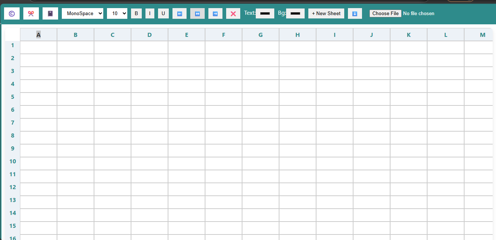

# 🧮 MS Excel Clone

A simplified web-based MS Excel clone built using **HTML**, **CSS**, and **JavaScript**. This application mimics basic spreadsheet functionalities like editing cells, managing multiple sheets, and performing simple computations, offering a hands-on understanding of how spreadsheets work under the hood.

## 🔗 Live Demo

[Click here to try the live version](#) *(Optional: Add your GitHub Pages or deployed link here)*

---

## 📸 Screenshots

![Excel Clone Screenshot]

*Example of the spreadsheet UI*

---

## ✨ Features

- ➕ Add/Delete Sheets
- 📄 Rename Sheets
- ✍️ Editable Cells
- 📑 Save/Load Sheet Data
- 🧮 Formula-based Calculation Support
- 📁 Local Storage Integration (Data persists)
- 🎨 Responsive UI with grid layout

---

## 🛠️ Tech Stack

| Technology | Description |
|------------|-------------|
| HTML5      | Markup structure |
| CSS3       | Styling and layout |
| JavaScript | Spreadsheet logic, event handling, data management |

---

## 🚀 Getting Started

To run this project locally:

1. Clone the repository:
   ```bash
   git clone https://github.com/Mritunjay-Saini/MS-Excel-Clone.git
